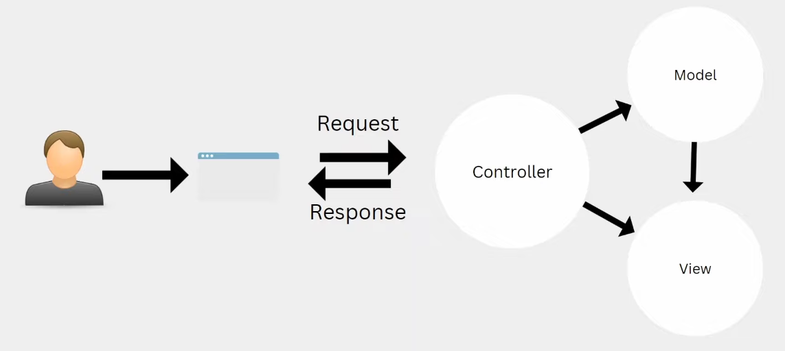

# BlogSpot

Basic practice blogging website to practice ASP.NET/MVC/EF.

# MVC explanation

MVC comprises of 3 components Model, View and Controller.

The Model component represents the Data, so for example a Class in C# stors data that has been retrieved from the DB, it will then be able to give this data to the view.

The View component represents the user interface, it opens up the option for a user to create, update, modify and delete data, these requests will be sent to the controller.

The Controller component represents the request handler, it takes requests made by users via the user interface processes the request and returns the view.

# EntityFramework commands

To create the DB 

	Add-Migration "Inital migration"
	Update-Database

Add-migration created the file 20240504160114_Inital migration.cs which includes all of the database/table configuration
Update-Database will check the migration folder against the DB and check what is missing, then it will update it based on the migration files.